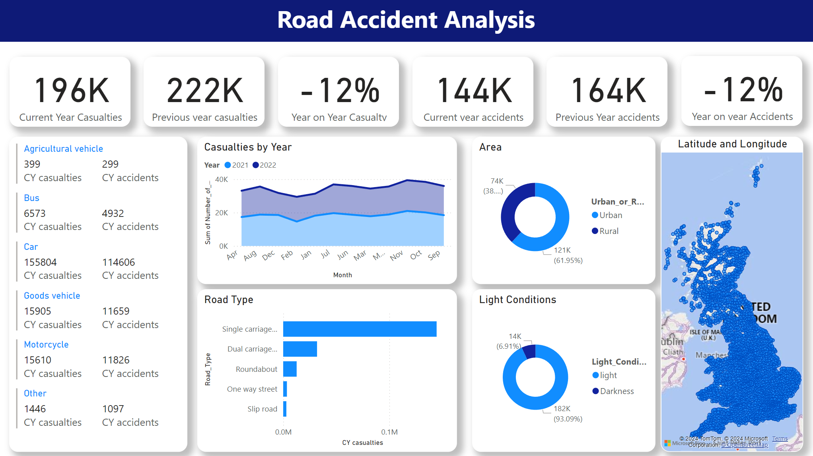

# 🚗 Road Accident Analysis Dashboard

[](https://opensource.org/licenses/MIT)
[](https://powerbi.microsoft.com/)
[](Dataset/Road%20Accident%20Data.xlsx)
[]()
[]()
[](https://github.com/pouryare)

A comprehensive Power BI dashboard analyzing road accident patterns in the United Kingdom. This interactive visualization tool provides insights into casualty trends, accident types, and geographical distribution of road incidents.



## 📋 Table of Contents
- [Overview](#overview)
- [Key Features](#key-features)
- [Dashboard Components](#dashboard-components)
- [Dataset Description](#dataset-description)
- [Technical Implementation](#technical-implementation)
- [Installation](#installation)
- [File Structure](#file-structure)
- [Key Insights](#key-insights)
- [License](#license)

## 🎯 Overview

The Road Accident Analysis Dashboard transforms complex accident data into actionable insights through detailed visualization of casualty patterns, vehicle types involved, road conditions, and geographical distribution. It enables data-driven decision-making for road safety planning and accident prevention strategies.

## ✨ Key Features

- 📊 Casualty Trend Analysis
- 🚗 Vehicle Type Distribution
- 🛣️ Road Type Analysis
- 📍 Geographic Distribution
- 🌍 Urban vs Rural Analysis
- 🌞 Light Condition Impact
- 📅 Year-over-Year Comparison

## 📊 Dashboard Components

### 1. Key Metrics Cards
- Current Year Casualties (196K)
- Previous Year Casualties (222K)
- Year on Year Casualty Change (-12%)
- Current Year Accidents (144K)
- Previous Year Accidents (164K)
- Year on Year Accidents Change (-12%)

### 2. Distribution Analysis
- Vehicle type breakdown
- Urban vs Rural distribution
- Light conditions analysis
- Road type distribution

### 3. Vehicle Analysis
- Agricultural vehicle (399 casualties, 299 accidents)
- Bus (6,573 casualties, 4,932 accidents)
- Car (155,804 casualties, 114,606 accidents)
- Goods vehicle (15,905 casualties, 11,659 accidents)
- Motorcycle (15,610 casualties, 11,826 accidents)
- Other (1,446 casualties, 1,097 accidents)

### 4. Geographic Analysis
- Interactive map visualization
- Urban/Rural distribution (Urban: 61.95%, Rural: 38.05%)
- Light conditions distribution (Light: 93.09%, Darkness: 6.91%)

## 📚 Dataset Description

The dataset includes comprehensive road accident records with the following key variables:

### Key Features
- 📅 Time and Date
- 📍 Location (Urban/Rural)
- 🚗 Vehicle Types
- 🛣️ Road Conditions
- 💡 Light Conditions
- 📊 Casualty Details

### Dataset Structure
- Road Accident Data.xlsx (Main dataset)
  - Accident details
  - Vehicle information
  - Location data
  - Environmental conditions
  - Casualty information

## 🔧 Technical Implementation

### Data Model Features
1. Clean and Transformed Data
2. Custom Calculated Measures
3. Dynamic Visualizations
4. Interactive Filters
5. Cross-filtering Capabilities

### Key DAX Measures
- Year-over-Year Calculations
- Casualty Rate Analysis
- Vehicle Type Distribution
- Geographic Distribution

## 📥 Installation

```bash
# Clone this repository
git clone https://github.com/pouryare/Road-Accident-Analysis.git
cd Road-Accident-Analysis

# Open the .pbix file
# Connect to your data source
# Refresh the dashboard
```

## 📁 File Structure

```
📦 Road-Accident-Analysis
 ┣ 📂 Dataset
 ┃ ┗ 📄 Road Accident Data.xlsx
 ┣ 📜 .gitattributes
 ┣ 📜 road accidents.pbix
 ┣ 📜 LICENSE
 ┣ 📜 README.md
 ┗ 📷 screenshot.png
```

## 🔍 Key Insights

1. **Overall Trends**
   - 12% reduction in casualties year-over-year
   - 12% reduction in total accidents
   - Significant urban concentration (61.95% of incidents)
   - Majority of accidents occur in daylight (93.09%)

2. **Vehicle Distribution**
   - Cars account for highest casualties (155,804)
   - Goods vehicles and motorcycles show similar casualty numbers (~15,000 each)
   - Bus-related incidents show high casualty-to-accident ratio
   - Agricultural vehicles show lowest incident numbers

3. **Road Type Analysis**
   - Single carriageway shows highest casualty numbers
   - Dual carriageways second most common
   - Roundabouts and one-way streets show lower incident rates
   - Slip roads report minimal casualties

4. **Environmental Factors**
   - Clear correlation between light conditions and accident rates
   - Urban areas show higher incident concentration
   - Seasonal variations visible in monthly trends
   - Geographic distribution shows concentration in populated areas

## 📄 License

This project is licensed under the MIT License - see the [LICENSE](LICENSE) file for details.

Made with ❤️ by [Pourya](https://github.com/pouryare)

[](https://github.com/pouryare)